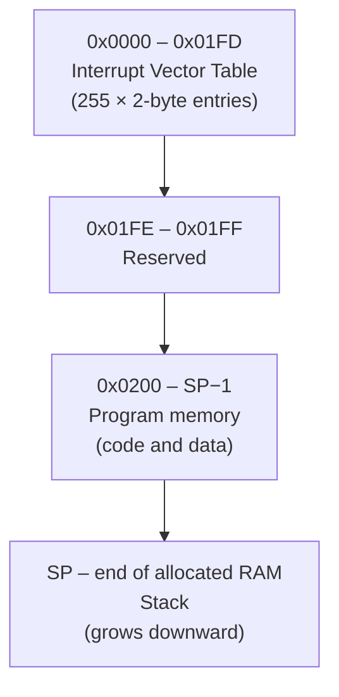
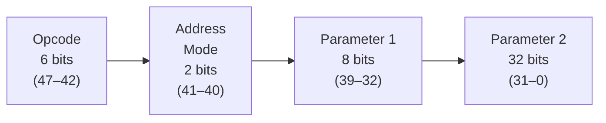

# CIL Architecture — Memory, Encoding, Registers & Stack

> Part of the [CIL Specification](Specification) — Version 2.1

---

## 1. Memory

CIL's instruction encoding addresses memory with a full 32-bit value (see §2 — the Parameter 2 field), so the instruction set itself imposes no 64 KB ceiling. The reference VM allocates a configurable amount of byte-addressable RAM per instance — `Globals.DefaultRamSize` (currently 1 MB) unless a host constructs the VM with a different size — and a running program only ever sees whatever amount its host VM was given. All multi-byte values are stored in **little-endian** format. Within that allocated RAM, the address space is partitioned as follows:

| Start    | End                     | Purpose                                                   |
|----------|-------------------------|-----------------------------------------------------------|
| `0x0000` | `0x01FD`                | Interrupt Vector Table (IVT) — 255 × 2-byte entries       |
| `0x01FE` | `0x01FF`                | Reserved                                                  |
| `0x0200` | `SP − 1`                | General-purpose program memory (code and data)            |
| `SP`     | end of allocated RAM    | Stack (grows downward from the top of allocated RAM)      |

The IVT occupies the first 510 bytes (`0x0000`–`0x01FD`), providing space for 255 two-byte handler addresses. Bytes `0x01FE`–`0x01FF` are reserved for future use.

The boundary between program memory and the stack is dynamic: the stack grows downward from the top of the allocated RAM, controlled by the Stack Segment (SS) and Stack Pointer (SP) registers — both initialized to the top of RAM on startup (an empty stack). Programs must not write into the stack region and the stack must not overflow into program memory; the reference implementation enforces the latter by rejecting any write at or below the end of the loaded program (see §4).

---

## 2. Instruction Encoding

Every CIL instruction is exactly **48 bits (6 bytes)** wide with the following fixed layout:

| Bits   | Width   | Field        | Description                                          |
|--------|---------|--------------|------------------------------------------------------|
| 47–42  | 6 bits  | Opcode       | Identifies the instruction                           |
| 41–40  | 2 bits  | Address Mode | How parameters are interpreted (see §2.1)            |
| 39–32  | 8 bits  | Parameter 1  | First operand (register byte or immediate)           |
| 31–0   | 32 bits | Parameter 2  | Second operand (register byte, 32-bit immediate, or a memory address) |

### 2.1 Addressing Modes

The two-bit address mode field controls how the VM interprets each parameter:

| Binary | Hex    | Mode                        |
|--------|--------|-----------------------------|
| `00`   | `0x00` | Register : Register         |
| `01`   | `0x01` | Value : Register            |
| `10`   | `0x02` | Register : Value            |
| `11`   | `0x03` | Value : Value               |

---

## 3. Registers

The VM must provide the following registers. All are represented by a single byte in the range `0xF0`–`0xFE`.

| Register | Byte   | Width   | Description                                      |
|----------|--------|---------|--------------------------------------------------|
| `PC`     | `0xF0` | 32-bit  | Program Counter — address of the next instruction |
| `IP`     | `0xF1` | 32-bit  | Instruction Pointer — current execution point    |
| `SP`     | `0xF2` | 32-bit  | Stack Pointer — top of stack (read-only)         |
| `SS`     | `0xF3` | 32-bit  | Stack Segment — base address of the stack        |
| `A`      | `0xF4` | 16-bit  | General purpose (composed of AL + AH)            |
| `AL`     | `0xF5` | 8-bit   | Lower byte of A                                  |
| `AH`     | `0xF6` | 8-bit   | Higher byte of A                                 |
| `B`      | `0xF7` | 16-bit  | General purpose (composed of BL + BH)            |
| `BL`     | `0xF8` | 8-bit   | Lower byte of B                                  |
| `BH`     | `0xF9` | 8-bit   | Higher byte of B                                 |
| `C`      | `0xFA` | 16-bit  | General purpose (composed of CL + CH)            |
| `CL`     | `0xFB` | 8-bit   | Lower byte of C                                  |
| `CH`     | `0xFC` | 8-bit   | Higher byte of C                                 |
| `X`      | `0xFD` | 32-bit  | General purpose                                  |
| `Y`      | `0xFE` | 32-bit  | General purpose                                  |

**SP is read-only.** It holds the absolute address of the top of the stack and must not be written by program code.

---

## 4. The Stack

The stack grows **downward** from the top of the allocated RAM and lives in the same shared address space as program code and data — there is no separate stack memory. Its base address is set by the Stack Segment (`SS`) register, which the program may configure; the VM initializes both `SS` and `SP` to the top of RAM on startup (an empty stack). The Stack Pointer (`SP`) tracks the current top of the stack and is updated automatically by `PSH` and `POP`.

Because the stack shares memory with the running program, an unbounded sequence of pushes (or of nested `CLL`/`CLT`/`CLF` calls, which push return addresses via a separate 255-entry call stack — see [[Spec-Instructions#64-flow-control|§6.4]]) must eventually be stopped before it corrupts the loaded code. A compliant VM must reject a stack write that would land at or below the end of the loaded program with a diagnostic, rather than silently overwriting code or reading/writing outside the allocated RAM.
