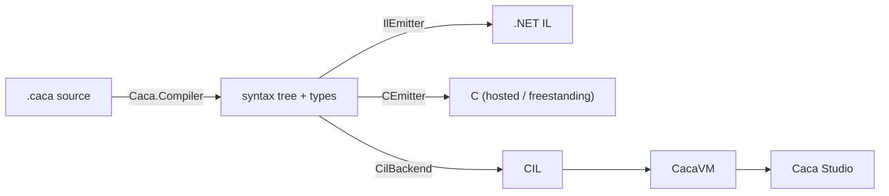
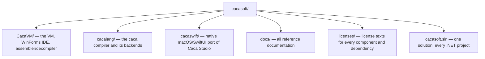

# cacasoft

A virtual machine and a compiler that targets it, developed together as one
project.

- **CacaVM** — a register-based virtual machine: CIL (the Caca Intermediate
  Language), a two-pass assembler/decompiler, and Caca Studio, its IDE
  (WinForms on Windows, a native SwiftUI port on macOS).
- **cacalang** — a general-purpose, C-like language (`caca`) with four
  compiler backends: a .NET IL target, a C target (hosted and freestanding,
  down to a GRUB-bootable kernel), and CIL — the backend that lets Caca
  Studio open and step through `.caca` source directly, not just raw CIL.



Each project can still be built and used on its own — CacaVM never requires
cacalang, and cacalang's IL/C backends never require CacaVM — but they are
developed as one repository so the CIL backend, the shared conformance
corpus, and the IDEs' `.caca` support stay in sync by construction rather
than by two repos' versions happening to line up.

This was originally two repositories joined by git submodules; both full
histories are now merged into this one (see the `CacaVM/` and `cacalang/`
commit history). The sibling-directory discovery convention both codebases
use — walk up to a directory named `CacaVM`, then look for a sibling
`cacalang`, or vice versa — still works unmodified, since both remain real
sibling directories on disk.

## Repository layout



## Clone

```sh
git clone https://github.com/Arawn-Davies/cacasoft
```

## Build

```sh
dotnet build cacasoft.sln
```

`cacasoft.sln` covers every .NET project in both `CacaVM/` and `cacalang/`,
including the shared `Caca.CilBackend`. Building `CacaVM/source/Caca.VM.Studio`
(or `cacaswift`, built separately via Swift Package Manager) automatically
picks up cacalang for `.caca` support, and cacalang's own `Caca.Tests`
automatically finds a built CacaVM CLI for its CacaVM-backend parity tests —
no configuration needed either direction.

```sh
dotnet test CacaVM/source/Caca.VM.Tests/Caca.VM.Tests.csproj
dotnet test cacalang/tests/Caca.Tests/Caca.Tests.csproj
```

## Documentation

Full reference documentation — the CIL specification, the standard library,
cacalang's language/grammar/CLI/architecture docs, and project overviews for
each component — lives in [`/docs`](docs) and is published to the
[GitHub Wiki](https://github.com/Arawn-Davies/cacasoft/wiki); start at
[docs/Home.md](docs/Home.md).

## License

CacaVM and cacaswift are released under the Clear BSD License; cacalang under
the MIT License. See [`/licenses`](licenses) for the full texts, including
third-party dependencies.
