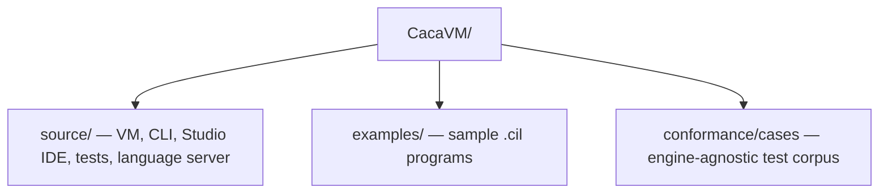

# CacaVM

A free and open source register-based virtual machine and intermediate language targeting .NET Standard.

CacaVM (CIL) provides a stable, portable compilation target with a small orthogonal instruction set, a two-pass assembler, a decompiler, and an integrated IDE (Caca Studio). The same CIL bytecode runs identically on any compliant VM implementation.

For the full language and VM specification, standard library reference, and instruction set, see [CIL-Specification](CIL-Specification) and [CIL-Standard-Library](CIL-Standard-Library).

[cacalang](Cacalang) compiles to CIL as a fourth backend (`caca build
--target cacavm`), covering a v1 subset of the language — control flow,
recursion, and integer/bool arithmetic, but not yet `float`, `extern func`,
or `string` beyond a literal `print`. See its
`cacalang/src/Caca.CilBackend/CilEmitter.cs` for the emitter and
[Cacalang-Architecture](Cacalang-Architecture) for how it addresses locals
and parameters without a frame-pointer register, which this VM's instruction
set does not leave room for.

---

## Repository layout



| Path | Contents |
|------|----------|
| `CacaVM/source/Caca.VM` | Core VM library (netstandard2.0) — registers, RAM, instruction execution |
| `CacaVM/source/Caca.VM.Cli` | Command-line runtime host (net10.0) |
| `CacaVM/source/Caca.VM.Studio` | WinForms IDE with assembler, decompiler, and step debugger (net10.0-windows) |
| `CacaVM/source/Caca.VM.Tests` | xUnit test suite |
| `CacaVM/source/Caca.VM.LanguageServer` | Language Server Protocol implementation for CIL (live errors) — client lives in cacalang's VS Code extension |
| `CacaVM/examples` | Sample `.cil` assembly programs |
| `CacaVM/conformance` | Cross-engine conformance corpus — see [CIL-Conformance-Suite](CIL-Conformance-Suite) |

---

## Building

Requires the [.NET 10 SDK](https://dotnet.microsoft.com/download). From the repository root:

```sh
# Build everything, including cacalang
dotnet build cacasoft.sln

# Run just CacaVM's tests
dotnet test CacaVM/source/Caca.VM.Tests/Caca.VM.Tests.csproj
```

> **Note:** Caca.VM.Studio targets `net10.0-windows`, but builds (not runs —
> WinForms itself is Windows-only) on any platform thanks to
> `EnableWindowsTargeting`, which is what lets its cacalang integration (see
> below) be verified by compiling it, even on a machine that can never
> actually run the IDE.

cacalang lives at `cacalang/`, a sibling of `CacaVM/` in this repository, so
Caca.VM.Studio automatically gains the ability to open a `.caca` file
directly (compiled to CIL, then handed to the existing assemble/run/debug
pipeline unchanged) — conditional on `Exists('../../../cacalang/...')` in
`Caca.VM.Studio.csproj`, so its CIL-only functionality never depends on that
directory being present.

---

## Running

```sh
# Run the built-in "Hello, World!" demo
dotnet run --project CacaVM/source/Caca.VM.Cli

# Compile and run a .cil source file directly
dotnet run --project CacaVM/source/Caca.VM.Cli -- path/to/program.cil

# Or run pre-compiled bytecode
dotnet run --project CacaVM/source/Caca.VM.Cli -- path/to/program.ilc
```

---

## Examples

The `CacaVM/examples` folder contains ready-to-assemble `.cil` programs:

| File | Description |
|------|-------------|
| `hello_world_db.cil` | Prints "Hello, World" using the `DB` pseudo-instruction and the write-string interrupt |
| `calculator.cil` | Demonstrates arithmetic instructions and integer output |
| `stdlib_demo.cil` | Signed 32-bit integer output, `atoi`, and `strcmp` — the standard library's newer additions |
| `all_features.cil` | A section-by-section tour of every implemented instruction and standard library routine — the file to read alongside [CIL-Specification](CIL-Specification) |
| `loop_counter.cil` | The simplest JMP-based loop: prints 1 through 10 — a good first step-through after `hello_world_db.cil` |
| `fizzbuzz.cil` | The classic, 1 to 20 — remainder computed by hand (no MOD opcode), and why the loop counter has to live in Y, not X |
| `factorial_recursive.cil` | Genuine recursion via CLL/RET, argument on the stack, result in X — and why a recursive call must save/restore any register it still needs afterward |
| `array_sum.cil` | Reads a small array of 32-bit integers by hand, four bytes at a time — the technique behind every local and parameter CilEmitter.cs addresses |
| `interactive_double.cil` | Reads a line, parses it with `atoi`, prints double it — the one example meant to be run directly, not read fixed output from |

Open any `.cil` file in Caca Studio to assemble, run, and step-debug it interactively.

---

## VS Code

For editors other than Caca Studio, syntax highlighting and live compile
errors are available via cacalang's VS Code extension (`cacalang/editors/vscode`) —
one extension covers both cacalang and CIL, each with its own language
server (`Caca.LanguageServer` and this repository's own
`Caca.VM.LanguageServer`), started independently. See
[Cacalang-VSCode-Extension](Cacalang-VSCode-Extension) for setup, including
how to point it at a server built from CacaVM.

---

## License

This project is released under the Clear BSD License — see
[`licenses/CacaVM-LICENSE`](../licenses/CacaVM-LICENSE). License texts for
all FOSS dependencies (xUnit, .NET SDK) are collected in
[`/licenses`](../licenses).
