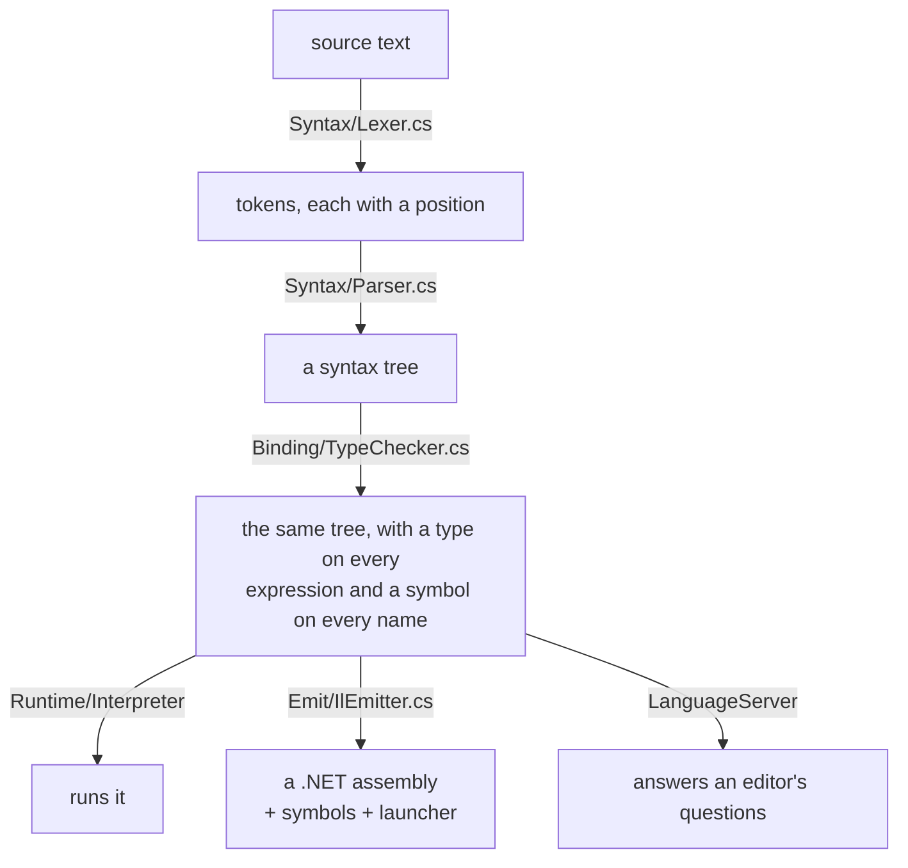

# How the compiler works

Five stages, each in its own folder, each producing something the next one
reads. Nothing reaches back.



## Diagnostics, not exceptions

Every stage reports problems into a `DiagnosticBag` and carries on. That is why
a run can report several errors, and why the language server can show errors for
a file that is half-typed and does not parse.

Each diagnostic has a position and a stable code; see
[`Cacalang-Diagnostics.md`](Cacalang-Diagnostics).

## Lexer

Reads the source as a string rather than a stream, which is what makes
lookahead and source positions possible. Produces `Token`s carrying a kind, the
text, a decoded value for literals, and a `SourceLocation`.

`SourceLocation` records a start, a length, and **both** a start and an end line
and column. The end matters: a span covering a loop or a function crosses lines,
and its last line cannot be recovered by adding a length to a column.

## Parser

Recursive descent, with precedence climbing for expressions. One method per
construct, and a small table giving each binary operator its precedence:

```
||  &&  ==/!=  </<=/>/>=  +/-  */ /%  unary  primary
```

All binary operators are left associative, which is why `10 - 2 - 3` is 5.

On an error it reports, then skips to the next statement boundary so the rest of
the file is still parsed. Where a token is missing it synthesizes one, so later
stages see a well-shaped tree.

## Type checker

One pass over the tree. It:

- collects every function signature **first**, so a call can name a function
  declared further down, or the one it is in;
- resolves the type of every expression and records it on the node;
- decides each `int` to `float` widening once and records it on the node, so
  the two backends cannot disagree about one;
- binds every name to a symbol carrying its type and where it was declared, and
  records every position a name appears.

That last part is what the language server answers hover, go-to-definition and
find-references from. The compiler itself does not need it.

## Interpreter

Walks the checked tree. Control flow is threaded through a returned `Flow` value
rather than exceptions, so `break`, `continue` and `return` cost no more than
the loops and calls containing them.

It runs the program on a thread whose stack size it chooses, so that a call
depth limit — not a stack overflow — is what stops runaway recursion. A stack
overflow cannot be caught and would take the process down.

## IL emitter

Writes a real .NET assembly with `PersistedAssemblyBuilder`. Every method is
declared before any body is emitted, which is what lets a call reference a
function defined later.

It also writes:

- **a portable PDB**, with a sequence point on each statement and names on the
  locals, so a debugger can step through the `.caca` source;
- **a native launcher**, produced from the apphost template the SDK ships, so
  the output can be run directly rather than through `dotnet`;
- **a runtime configuration**, without which the host does not know which
  runtime to load.

One method is generated into every assembly: the float formatter. A compiled
program cannot call into the compiler, and the interpreter and the compiled
program have to print `1.0` the same way, so the rule is emitted alongside.

## The C backend

`Emit/CEmitter.cs` renders the same type-checked tree as a single,
self-contained C file, built with any C compiler: `caca build --target c`.
Generated code touches the world only through the `caca_` runtime functions
emitted at the top of the file (`Emit/CRuntime.cs`), so a freestanding
runtime — one that boots without an operating system — only has to supply that
contract, not libc. Extern functions are .NET methods, so this target rejects
them.

The fiddly parts are the ones .NET otherwise does quietly: int arithmetic is
carried out on the unsigned representation because signed overflow is
undefined behaviour in C, and the float formatter reproduces .NET's shortest
round-trip text — digits found by rounding to 1..17 significant places until
one reads back as the same value, laid out with .NET's fixed-versus-scientific
thresholds.

`CRuntime.cs` holds two implementations of the same `caca_*` contract: a
hosted one built on libc, and a freestanding one that is not — a PS/2
keyboard driver, a VGA text buffer, a serial port, and a bump allocator,
built without an operating system beneath any of it. [`boot/`](Cacalang-Boot)
turns a `--target c-freestanding` file into a GRUB-bootable ISO and boots it
in QEMU, headless or in a window. Floats and extern functions are not part of
that runtime yet; see [Cacalang-Boot](Cacalang-Boot).

## The CacaVM backend

`src/Caca.CilBackend/CilEmitter.cs` renders the same type-checked tree as CIL
assembly source, the language of [CacaVM](CacaVM) —
a small register-based virtual machine, a sibling project: `caca build
--target cacavm`. It is the only backend that does not live inside
`Caca.Compiler` — it is its own project, depending on the compiler's public
AST and binding types without the compiler depending on it back. Only
`Caca.Cli`, which already references both, wires them together.

CacaVM's instruction set forced a real design problem the other backends
never meet: five registers, only two of them (`X`, `Y`) wide enough for a
32-bit `int`; every memory access and every byte of *data* crossing the
stack one byte at a time; and no frame-pointer register to spare, since
expression evaluation already needs both wide registers free. Locals and
parameters are therefore addressed relative to the *current* stack pointer
using an offset the emitter tracks at compile time as it walks the tree
(`_depth`) — the same technique a stack-machine compiler uses to track
operand-stack depth — and every 32-bit value crossing memory or the stack is
packed and unpacked four bytes by hand. Reserving and releasing that
stack space is the one exception: `PSHN`/`POPN` (added to CacaVM's ISA
specifically for this backend — see CacaVM's `CIL-Specification.md` §6.5)
zero-fill or discard an arbitrary byte count in a single instruction, so a
function's locals are reserved and released without one `PSH 0`/`POP` per
byte — the emitter used to do exactly that, and for a function with a
`read_int` scratch buffer (see below) it dominated the emitted code: 256 of
FizzBuzz's ~270 stack-setup instructions were that one buffer's
zero-initialization, now a single `PSHN`.
`CilEmitter.cs`'s own remarks describe the register discipline this requires
in full; getting it wrong is exactly what a wrong-byte-order argument, a
clobbered scratch register, or a branch condition backwards look like, and all
three turned up during development, each caught only by actually running the
emitted code on the VM — a lesson recorded in the emitter's own comments at
each site, not just fixed silently.

The v1 subset this backend covers is deliberately narrower than the other
three: CacaVM has no floating point unit or instructions for one at all, so
`float` is rejected (`CACA0027`), the same way `extern func` is rejected for
having no CLR to call into (`CACA0026`). A `string` may only appear as the
literal, direct operand of `print` (`CACA0028`) — not as a variable,
parameter, return value, or in a comparison or concatenation — and
`read_string` is rejected outright (`CACA0029`), since no string-input
routine exists and `string` cannot be a variable on this target regardless.

`read_int` **is** implemented (`Emit/CilEmitter.cs`'s `EmitReadInt`): it reads
a line into a 256-byte scratch buffer reserved once per function (shared
across every `read_int` in that function, since reads happen one at a time)
and hands it to CacaVM's own `atoi` (added to CacaVM's standard library for
exactly this). One gap is inherited, not created, by this: CacaVM's
line-read interrupt takes no maximum-length parameter, so a line longer than
the buffer has already overwritten adjacent memory by the time this emitter's
own length clamp ever runs — closing that needs a bound added to the
interrupt itself, on CacaVM's side, not something reachable from CIL.

Everything else — control flow, recursion, arithmetic with the same 32-bit
wraparound as the other backends, `%` synthesized from `/` and `*` since
CacaVM has no MOD opcode — is held to the same parity standard as the rest of
the language.

## The backends must agree

Every language feature is implemented in each backend — CacaVM's v1 subset
of it, at least — and a set of parity tests runs the same program through all
of them and compares the output. This is the single most useful class of test
in the project: it is what catches an emitter that produces IL the runtime
rejects, C a compiler refuses, or CIL the VM runs but computes something
different — the CacaVM parity tests run the emitted CIL on the actual VM,
not just on inspected text, for exactly that reason.

## Language server

`src/Caca.LanguageServer` speaks LSP over stdin and stdout. It compiles the
whole file on every keystroke — programs here are small enough for that to be
imperceptible, and it means the editor sees exactly what the compiler sees,
rather than a second, incremental analysis that could drift out of agreement
with it.

The JSON-RPC framing is written out rather than taken from a package: it is a
few dozen lines, and this project is meant to be read.

## Stage by file

| Stage | Where |
|---|---|
| Lexer | `src/Caca.Compiler/Syntax/Lexer.cs` |
| Parser | `src/Caca.Compiler/Syntax/Parser.cs` |
| Type checker | `src/Caca.Compiler/Binding/TypeChecker.cs` |
| Interpreter | `src/Caca.Compiler/Runtime/Interpreter.cs` |
| IL emitter, and the symbols it writes | `src/Caca.Compiler/Emit/IlEmitter.cs` |
| C emitter and its runtime | `src/Caca.Compiler/Emit/CEmitter.cs`, `Emit/CRuntime.cs` |
| The native launcher | `src/Caca.Compiler/Emit/AppHost.cs` |
| CacaVM (CIL) emitter | `src/Caca.CilBackend/CilEmitter.cs` |
| Language server | `src/Caca.LanguageServer/` |

## Where things are

| Path | What is in it |
|---|---|
| `src/Caca.Compiler/Syntax` | Lexer, parser, tokens, the syntax tree |
| `src/Caca.Compiler/Binding` | Types, symbols, the type checker |
| `src/Caca.Compiler/Diagnostics` | Locations, codes, the bag |
| `src/Caca.Compiler/Runtime` | The interpreter |
| `src/Caca.Compiler/Emit` | The IL and C emitters, and the apphost writer |
| `src/Caca.CilBackend` | The CacaVM (CIL) emitter — outside `Caca.Compiler` on purpose |
| `src/Caca.LanguageServer` | LSP server and protocol |
| `src/Caca.Cli` | The `caca` command and the REPL |
| `editors/vscode` | The VS Code extension |
| `tests/Caca.Tests` | Everything above, tested |
