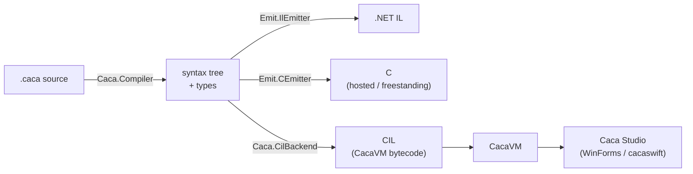
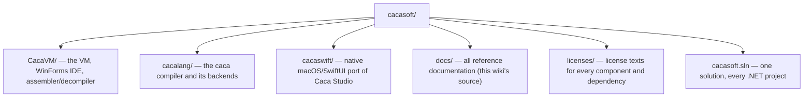

# cacasoft

Welcome to the **cacasoft** wiki — reference documentation for the whole suite:

- **CacaVM** — a register-based virtual machine (CIL, the Caca Intermediate Language), its WinForms and macOS/Swift IDEs (Caca Studio), and the CIL assembler/decompiler.
- **cacalang** — a general-purpose compiler (`caca`) with four backends: a .NET IL target, a C target (hosted and freestanding), and CacaVM's own CIL.

For source code, build instructions, and repository layout, see the [README](https://github.com/Arawn-Davies/cacasoft#readme). This wiki is the reference manual: project overviews, language/VM specifications, standard library, CLI, and internals.

---

## CacaVM / CIL documentation

| Page | Description |
|------|-------------|
| [CacaVM](CacaVM) | Project overview: repository layout, building, running, examples |
| [CIL-Specification](CIL-Specification) | The CIL v2.1 specification: memory model, instruction encoding, registers, the stack, the full instruction reference, and the `.ilc` executable format |
| [CIL-Standard-Library](CIL-Standard-Library) | Kernel (`KEI`) and software (`SWI`) interrupt reference — stdio, string utilities |
| [CIL-Conformance-Suite](CIL-Conformance-Suite) | The cross-engine test corpus shared by the C# and Swift VM implementations |
| [CacaSwift](CacaSwift) | The native macOS/SwiftUI port of Caca Studio (`cacaswift`) — building, packaging, Xcode |

## cacalang documentation

| Page | Description |
|------|-------------|
| [Cacalang](Cacalang) | Project overview: getting started, documentation index, credits |
| [Cacalang-Language](Cacalang-Language) | A tour of the language, with examples |
| [Cacalang-Grammar](Cacalang-Grammar) | The formal grammar and the semantics of each construct |
| [Cacalang-CLI](Cacalang-CLI) | `run`, `build`, `check`, the REPL, and debugging a compiled program |
| [Cacalang-Editor](Cacalang-Editor) | The language server, and the Visual Studio Code extension |
| [Cacalang-VSCode-Extension](Cacalang-VSCode-Extension) | Installing and configuring the VS Code extension in detail |
| [Cacalang-Diagnostics](Cacalang-Diagnostics) | Every error the compiler reports, and what causes it |
| [Cacalang-Architecture](Cacalang-Architecture) | How the compiler works, stage by stage |
| [Cacalang-Boot](Cacalang-Boot) | Booting a `--target c-freestanding` program under GRUB and QEMU |
| [Cacalang-History](Cacalang-History) | Where the project came from, and what changed |
| [Cacalang-Contributing](Cacalang-Contributing) | Building, and how to add a language feature |
| [Cacalang-Grammar-Original-Sketch](Cacalang-Grammar-Original-Sketch) | The informal grammar sketch this project started from (historical, superseded by Cacalang-Grammar) |

---

## What is CIL?

The Caca Intermediate Language (CIL) is a low-level, register-based intermediate language designed for deterministic, portable execution across virtual machine implementations. It provides a stable compilation target independent of the underlying host architecture.

**Design goals:**

- **Platform independence** — the same CIL bytecode runs identically on any compliant VM
- **Simplicity** — a small, orthogonal instruction set that is straightforward to implement
- **Portability** — suitable for implementation in managed runtimes (.NET/CLR), native code (C/C++), and constrained hardware (e.g. Z80/CP/M)
- **Determinism** — no undefined behaviour; all edge cases are specified

## What is cacalang?

cacalang (`caca`) is a general-purpose compiler with four backends: a .NET IL target, a C target (hosted and freestanding, including a bootable freestanding runtime — see [Cacalang-Boot](Cacalang-Boot)), and CacaVM's own CIL — the thing that lets Caca Studio open and step through `.caca` source, not just raw CIL. Its CIL emitter had to solve a real problem CacaVM's register file creates: with only two registers (`X`, `Y`) wide enough for a 32-bit value and no register to spare as a frame pointer, locals and parameters are addressed relative to the current stack pointer using a compile-time-tracked depth, not a frame pointer in a register or in memory.



---

## Repository layout



| Project | Description |
|---------|-------------|
| `CacaVM/source/Caca.VM` | Core VM library — netstandard2.0, usable from any .NET host |
| `CacaVM/source/Caca.VM.Cli` | Command-line runtime — compiles and runs `.cil` source directly, or loads pre-compiled bytecode |
| `CacaVM/source/Caca.VM.Studio` | WinForms IDE — assembler, decompiler, and step-through debugger (Windows only) |
| `CacaVM/source/Caca.VM.Tests` | xUnit test suite covering the VM, assembler, and decompiler |
| `CacaVM/source/Caca.VM.LanguageServer` | Language Server Protocol implementation for CIL (live errors) |
| `cacaswift/` | Native macOS/SwiftUI port of Caca Studio |
| `cacalang/src/Caca.Compiler` | The compiler front end and shared IR |
| `cacalang/src/Caca.Cli` | The `caca` command-line tool — `run`, `build`, `check`, the REPL |
| `cacalang/src/Caca.CilBackend` | The CIL backend — shared by cacalang and Caca Studio |
| `cacalang/src/Caca.LanguageServer` | Language Server Protocol implementation for cacalang |
| `cacalang/tests/Caca.Tests` | Test suite covering all four backends |

## Getting started

### Prerequisites

- [.NET 10 SDK](https://dotnet.microsoft.com/download)
- Windows (for Caca Studio only) or macOS (for cacaswift); the VM library, runtime, and cacalang compiler are cross-platform

### Build

```sh
dotnet build cacasoft.sln
```

### Run the tests

```sh
dotnet test CacaVM/source/Caca.VM.Tests/Caca.VM.Tests.csproj
dotnet test cacalang/tests/Caca.Tests/Caca.Tests.csproj
```

### Run a `.cil` file

```sh
dotnet run --project CacaVM/source/Caca.VM.Cli -- myprogram.cil
```

A compile error is reported in `file(line,col): error CIL001: message` format and exits non-zero; anything else is loaded and executed as pre-compiled bytecode instead.

### Run a `.caca` file

```sh
dotnet run --project cacalang/src/Caca.Cli -- run myprogram.caca
```

See [Cacalang-CLI](Cacalang-CLI) for `build`, `check`, and the REPL.

### Editing in VS Code

Syntax highlighting and live compile errors for both cacalang and CIL are available via cacalang's VS Code extension (`cacalang/editors/vscode`) — one install covers both languages. See [Cacalang-VSCode-Extension](Cacalang-VSCode-Extension) for setup.
