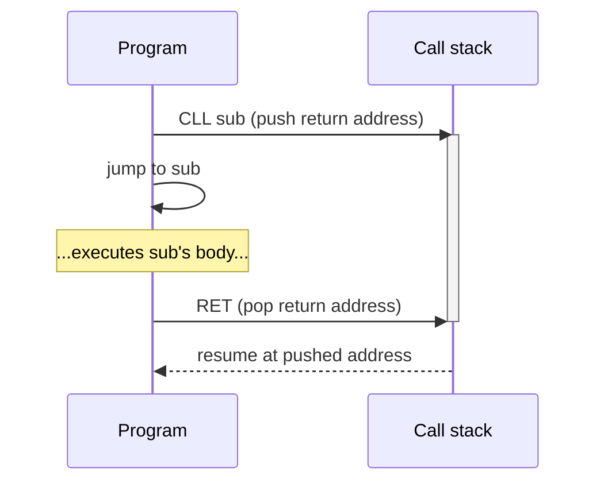

# CIL Instructions — Program Flow, Reference & Quick Reference

> Part of the [CIL Specification](Specification) — Version 2.1

---

## 5. Program Flow

Execution begins at the first byte of program memory and proceeds sequentially — one 6-byte instruction at a time — until a flow-control instruction is encountered or a `KEI 0x02` (halt) interrupt is issued.

Example (assembly pseudocode):

```
NOP
JMP halt
halt:
CLI
HLT
```

`NOP` is at relative address `0x00`, `JMP` at `0x01`, `CLI` at `0x03`, and so on. A `JMP halt` is encoded as `0x10 <address-of-halt>`.

---

## 6. Instruction Reference

### 6.1 Register & Memory Operations

#### MOV — Move `0x01`
| | |
|-|-|
| **Parameters** | `[dest: register]`, `[src: register or value]` |
| **Addressing modes** | `RegReg`, `RegVal` |
| **Description** | Copies `src` into `dest`. The destination must be a register; the source may be a register or an immediate value. |

#### MOM — Move to Memory `0x3A`
| | |
|-|-|
| **Parameters** | `[src: register or value]`, `[dest: memory address or register]` |
| **Addressing modes** | `RegVal`, `ValVal`, `RegReg`, `ValReg` |
| **Description** | Writes `src` to the memory address given by `dest`. When `dest` is a register (`RegReg`/`ValReg`), the address is that register's *runtime value* — register-indirect addressing, e.g. `MOM AL, X` stores `AL` at whatever address `X` currently holds, not at a literal baked into the instruction. When `dest` is a value (`RegVal`/`ValVal`), the address is a literal, as before. |

#### MOE — Move from Memory `0x3B`
| | |
|-|-|
| **Parameters** | `[dest: register]`, `[src: memory address or register]` |
| **Addressing modes** | `RegVal`, `RegReg` |
| **Description** | Reads the byte at `src` in memory and places it into `dest` (always a register). When `src` is a register (`RegReg`), the address is that register's *runtime value* — register-indirect addressing, e.g. `MOE AH, X` loads from whatever address `X` currently holds. When `src` is a value (`RegVal`), the address is a literal, as before. |

#### SWP — Swap `0x02`
| | |
|-|-|
| **Parameters** | `[reg1: register]`, `[reg2: register]` |
| **Addressing modes** | `RegReg` |
| **Description** | Swaps the values stored in the two registers. |

#### TEQ — Test Equal `0x1A`
| | |
|-|-|
| **Parameters** | `[reg1: register]`, `[reg2: register]` |
| **Description** | Sets the logic flag if `reg1 == reg2`. The next conditional instruction will act on this result. |

#### TNE — Test Not Equal `0x1B`
| | |
|-|-|
| **Parameters** | `[reg1: register]`, `[reg2: register]` |
| **Description** | Sets the logic flag if `reg1 != reg2`. |

#### TLT — Test Less Than `0x1C`
| | |
|-|-|
| **Parameters** | `[reg1: register]`, `[reg2: register]` |
| **Description** | Sets the logic flag if `reg1 < reg2`. |

#### TMT — Test More Than `0x1D`
| | |
|-|-|
| **Parameters** | `[reg1: register]`, `[reg2: register]` |
| **Description** | Sets the logic flag if `reg1 > reg2`. |

---

### 6.2 Arithmetic

#### ADD — Add `0x04`
| | |
|-|-|
| **Parameters** | `[dest: register]`, `[src: register or value]` |
| **Addressing modes** | `RegReg`, `RegVal` |
| **Description** | `dest = dest + src` |

#### SUB — Subtract `0x05`
| | |
|-|-|
| **Parameters** | `[dest: register]`, `[src: register or value]` |
| **Addressing modes** | `RegReg`, `RegVal` |
| **Description** | `dest = dest - src` |

#### INC — Increment `0x08`
| | |
|-|-|
| **Parameters** | `[reg: register]` |
| **Description** | `reg++` |

#### DEC — Decrement `0x09`
| | |
|-|-|
| **Parameters** | `[reg: register]` |
| **Description** | `reg--` |

#### MUL — Multiply `0x30`
| | |
|-|-|
| **Parameters** | `[dest: register]`, `[src: register or value]` |
| **Addressing modes** | `RegReg`, `RegVal` |
| **Description** | `dest = dest * src` |

#### DIV — Divide `0x31`
| | |
|-|-|
| **Parameters** | `[dest: register]`, `[src: register or value]` |
| **Addressing modes** | `RegReg`, `RegVal` |
| **Description** | `dest = dest / src` (integer division) |

---

### 6.3 Bitwise Operations

#### SHL — Shift Left `0x06`
| | |
|-|-|
| **Parameters** | `[src: register]`, `[positions: value]` |
| **Description** | Shifts `src` left by `positions` bits. Equivalent to multiplying by 2 per position. |

#### SHR — Shift Right `0x07`
| | |
|-|-|
| **Parameters** | `[src: register]`, `[positions: value]` |
| **Description** | Shifts `src` right by `positions` bits. Equivalent to integer division by 2 per position. |

#### ROL — Rotate Left `0x0E`
| | |
|-|-|
| **Parameters** | `[src: register]`, `[positions: value]` |
| **Description** | Rotates `src` left by `positions` bits. Bits shifted off the left are appended on the right. |

#### ROR — Rotate Right `0x0F`
| | |
|-|-|
| **Parameters** | `[src: register]`, `[positions: value]` |
| **Description** | Rotates `src` right by `positions` bits. Bits shifted off the right are appended on the left. |

#### AND — Bitwise AND `0x0A`
| | |
|-|-|
| **Parameters** | `[srcA: register]`, `[srcB: register or value]` |
| **Description** | `srcA = srcA & srcB` |

#### BOR — Bitwise OR `0x0B`
| | |
|-|-|
| **Parameters** | `[srcA: register]`, `[srcB: register or value]` |
| **Description** | `srcA = srcA \| srcB` |

#### XOR — Bitwise XOR `0x0C`
| | |
|-|-|
| **Parameters** | `[srcA: register]`, `[srcB: register or value]` |
| **Description** | `srcA = srcA ^ srcB` |

#### NOT — Bitwise NOT `0x0D`
| | |
|-|-|
| **Parameters** | `[src: register]` |
| **Description** | `src = ~src` |

---

### 6.4 Flow Control

#### JMP — Jump `0x10`
| | |
|-|-|
| **Parameters** | `[dest: register, address, or label]` |
| **Description** | Unconditionally sets the program counter to `dest`. Labels are resolved to addresses by the assembler. |

#### CLL — Call `0x11`
| | |
|-|-|
| **Parameters** | `[dest: register, address, or label]` |
| **Description** | Pushes the address of the next instruction onto the call stack, then jumps to `dest`. The call stack holds at most 255 nested calls (shared with `CLT`/`CLF`); exceeding that depth is a fatal error and a compliant VM must raise a clean diagnostic rather than corrupt state. |

#### RET — Return `0x12`
| | |
|-|-|
| **Parameters** | *(none)* |
| **Description** | Pops the top of the call stack and resumes execution there. Executing `RET` with nothing on the call stack (no matching `CLL`/`CLT`/`CLF`) is a fatal error and must raise a clean diagnostic. |



#### JMT — Jump if True `0x13`
| | |
|-|-|
| **Parameters** | `[dest: register, address, or label]` |
| **Description** | Jumps to `dest` if the previous test instruction set the logic flag to true. |

#### JMF — Jump if False `0x14`
| | |
|-|-|
| **Parameters** | `[dest: register, address, or label]` |
| **Description** | Jumps to `dest` if the previous test instruction set the logic flag to false. |

#### CLT — Call if True `0x17`
| | |
|-|-|
| **Parameters** | `[dest: register, address, or label]` |
| **Description** | Like `CLL`, but only executes if the logic flag is true. |

#### CLF — Call if False `0x18`
| | |
|-|-|
| **Parameters** | `[dest: register, address, or label]` |
| **Description** | Like `CLL`, but only executes if the logic flag is false. |

---

### 6.5 Stack Manipulation

#### PSH — Push `0x20`
| | |
|-|-|
| **Parameters** | `[data: register or value]` |
| **Description** | Decrements `SP`, then writes `data` at the new `SP`. The stack shares memory with the running program (see §4); a push that would land at or below the end of the loaded code is a fatal error and must raise a clean diagnostic rather than overwrite it. |

#### POP — Pop `0x21`
| | |
|-|-|
| **Parameters** | `[dest: register]` |
| **Description** | Reads the value at `SP` into `dest`, then increments `SP`. Popping with an empty stack (`SP` already at the top of RAM) is a fatal error and must raise a clean diagnostic. |

---

### 6.6 I/O

> **Not implemented yet.** All six opcodes below assemble and execute without
> error, but the reference VM currently treats every one of them as a no-op —
> they advance past the instruction and touch nothing else: no port is read,
> no register or memory is written. This is reserved encoding space for a
> future port-I/O model, not a working feature with an unlisted limitation;
> do not rely on any of them until this notice is removed.

#### INB — Receive Byte `0x24`
| | |
|-|-|
| **Parameters** | `[port]`, `[dest: register]` |
| **Description** | Reads a byte from `port` into `dest`. |

#### INW — Receive Word `0x25`
| | |
|-|-|
| **Parameters** | `[port]`, `[dest: register]` |
| **Description** | Reads a 16-bit word from `port` into `dest`. |

#### IND — Receive Double Word `0x26`
| | |
|-|-|
| **Parameters** | `[port]`, `[dest: register]` |
| **Description** | Reads a 32-bit double word from `port` into `dest`. |

#### OUB — Send Byte `0x27`
| | |
|-|-|
| **Parameters** | `[port]`, `[src: register or value]` |
| **Description** | Writes a byte from `src` to `port`. |

#### OUW — Send Word `0x28`
| | |
|-|-|
| **Parameters** | `[port]`, `[src: register or value]` |
| **Description** | Writes a 16-bit word from `src` to `port`. |

#### OUD — Send Double Word `0x29`
| | |
|-|-|
| **Parameters** | `[port]`, `[src: register or value]` |
| **Description** | Writes a 32-bit double word from `src` to `port`. |

---

### 6.7 Interrupts

#### SWI — Software Interrupt `0x2A`
| | |
|-|-|
| **Parameters** | `[interrupt number]` |
| **Description** | Invokes the software interrupt handler for the given number. |

#### KEI — Kernel Interrupt `0x2B`
| | |
|-|-|
| **Parameters** | `[interrupt number]` |
| **Description** | Invokes the kernel interrupt handler for the given number. See [[Standard-Library]] for defined interrupt numbers. |

---

## 7. Quick Reference Table

| Mnemonic | Opcode  | Category            | Summary                        |
|----------|---------|---------------------|--------------------------------|
| `MOV`    | `0x01`  | Register/Memory     | Copy value into register       |
| `SWP`    | `0x02`  | Register/Memory     | Swap two registers             |
| `ADD`    | `0x04`  | Arithmetic          | dest = dest + src              |
| `SUB`    | `0x05`  | Arithmetic          | dest = dest − src              |
| `SHL`    | `0x06`  | Bitwise             | Shift left                     |
| `SHR`    | `0x07`  | Bitwise             | Shift right                    |
| `INC`    | `0x08`  | Arithmetic          | dest++                         |
| `DEC`    | `0x09`  | Arithmetic          | dest--                         |
| `AND`    | `0x0A`  | Bitwise             | Bitwise AND                    |
| `BOR`    | `0x0B`  | Bitwise             | Bitwise OR                     |
| `XOR`    | `0x0C`  | Bitwise             | Bitwise XOR                    |
| `NOT`    | `0x0D`  | Bitwise             | Bitwise NOT                    |
| `ROL`    | `0x0E`  | Bitwise             | Rotate left                    |
| `ROR`    | `0x0F`  | Bitwise             | Rotate right                   |
| `JMP`    | `0x10`  | Flow Control        | Unconditional jump             |
| `CLL`    | `0x11`  | Flow Control        | Call subroutine                |
| `RET`    | `0x12`  | Flow Control        | Return from subroutine         |
| `JMT`    | `0x13`  | Flow Control        | Jump if true                   |
| `JMF`    | `0x14`  | Flow Control        | Jump if false                  |
| `CLT`    | `0x17`  | Flow Control        | Call if true                   |
| `CLF`    | `0x18`  | Flow Control        | Call if false                  |
| `TEQ`    | `0x1A`  | Register/Memory     | Test equal                     |
| `TNE`    | `0x1B`  | Register/Memory     | Test not equal                 |
| `TLT`    | `0x1C`  | Register/Memory     | Test less than                 |
| `TMT`    | `0x1D`  | Register/Memory     | Test more than                 |
| `PSH`    | `0x20`  | Stack               | Push onto stack                |
| `POP`    | `0x21`  | Stack               | Pop from stack                 |
| `INB`    | `0x24`  | I/O                 | Receive byte from port         |
| `INW`    | `0x25`  | I/O                 | Receive word from port         |
| `IND`    | `0x26`  | I/O                 | Receive double word from port  |
| `OUB`    | `0x27`  | I/O                 | Send byte to port              |
| `OUW`    | `0x28`  | I/O                 | Send word to port              |
| `OUD`    | `0x29`  | I/O                 | Send double word to port       |
| `SWI`    | `0x2A`  | Interrupts          | Software interrupt             |
| `KEI`    | `0x2B`  | Interrupts          | Kernel interrupt               |
| `MUL`    | `0x30`  | Arithmetic          | dest = dest × src              |
| `DIV`    | `0x31`  | Arithmetic          | dest = dest ÷ src              |
| `MOM`    | `0x3A`  | Register/Memory     | Write register/value to memory |
| `MOE`    | `0x3B`  | Register/Memory     | Read memory into register      |
